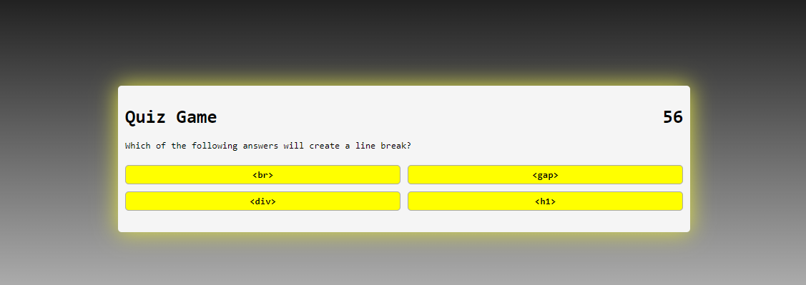

# amazing-quiz-app

## Description

This project is a quiz game created mostly using Javascript.  I am still not very confident in my abilities to use JS, so the code may look pretty rough.  All (most) of the questions are based on HTML, CSS, or JavaScript languages.  The game is short, lasting only 60 seconds or 9 questions. During this project I utilized and learned a lot about using JSON and localstorage.  There were many struggles in the creation of this quiz app, the parts I found most difficult were getting the score to save properly and stopping the timer from going below zero also proved more difficult than it probably should have.  

## Installation

Run the index.html file in a browser window or go to the github pages link here:  <a href="https://max24p7.github.io/amazing-quiz-app/">https://max24p7.github.io/amazing-quiz-app/</a>

## Usage

To start the quiz, click start and answer the questions as best you can.  You will be alotted 60 seconds and for every question that you get wrong you will lose 10 seconds.  There are a total of 9 questions so try to finish them all in the given time.  When you finish the quiz, please save your initials with your final score.  All scores will be logged in the console.  Click reset to the start over.

## Credits

https://www.youtube.com/watch?v=riDzcEQbX6k

https://unused-css.com/blog/css-outer-glow/

https://cssgradient.io/

https://developer.mozilla.org/en-US/docs/Web/JavaScript/Reference/Global_Objects/JSON/stringify